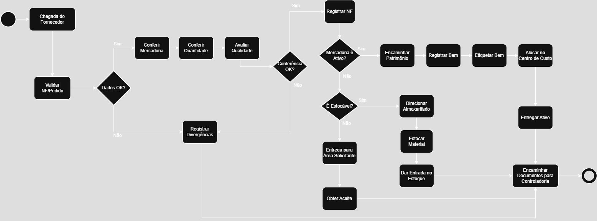

# Mapeamento do Processo de Recebimento de Compras

Projeto desenvolvido para a disciplina Processos de Software na Unisinos. Mapeei o fluxo de Recebimento de Compras da empresa XYZ usando notação BPMN e Draw.io. O diagrama abrange validação de documentos, conferência de mercadorias e registros, aplicando análise de processos.

## Fluxograma

## Detalhes
- **Ferramenta**: Draw.io
- **Formato**: BPMN
- **Entrega**: Arquivo PDF disponível [aqui](ENTREGUE_VERSAO_FINAL_desafio_processos_software_thiago-ap-da-silva-rodrigues-turma-061283_20251_03.drawio.pdf).

## Aprendizado
Apliquei conceitos de análise e mapeamento de processos, entregando uma representação visual clara das etapas e fluxos.
